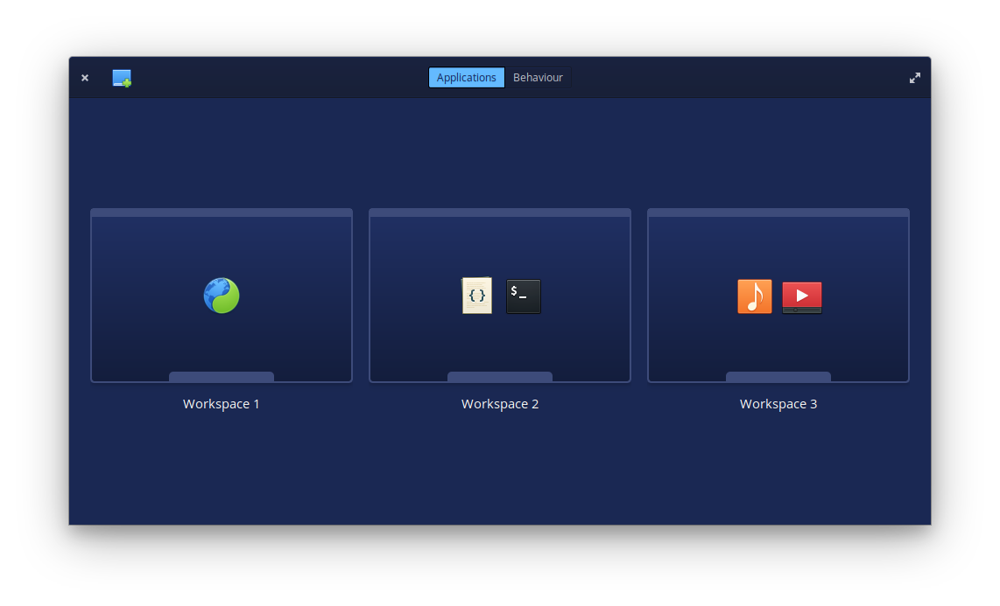

# Blockbuster
### Take control of your workspaces.



Blockbuster allows you to pre-assign applications to their workspaces so that when you open an application, it appears on it's workspace.
Other features include:
* Snap a window to bottom to open multitasking view
* Switch to previous workspace if current is empty
* Switch to a new workspace when a window is maximized

## Installation
[](https://appcenter.elementary.io/com.github.donadigo.blockbuster)

### Dependencies
These dependencies must be present before building
 - `valac`
 - `gtk+-3.0`
 - `granite`
 - `meson`
 - `gala`
 - `clutter-1.0`
 - `libbamf3`
 - `libwnck-3-dev`

 **You can install these on a Ubuntu-based system by executing this command:**

 `sudo apt install valac libgranite-dev libgala-dev meson libclutter-1.0-dev libbamf3-dev libwnck-3-dev`

 ### Building
```
meson build
cd build
meson configure -Dprefix=/usr
ninja
```

### Installing & executing
```
sudo ninja install
com.github.donadigo.blockbuster
```

### Reporting bugs & debugging
When reporting a bug you should include as much information as possible, that is the system that you're running, what you did in order to have the bug appear and probably a simple list of steps on how to reproduce the issue, however it is not required as some issues are not easily reproducible.
